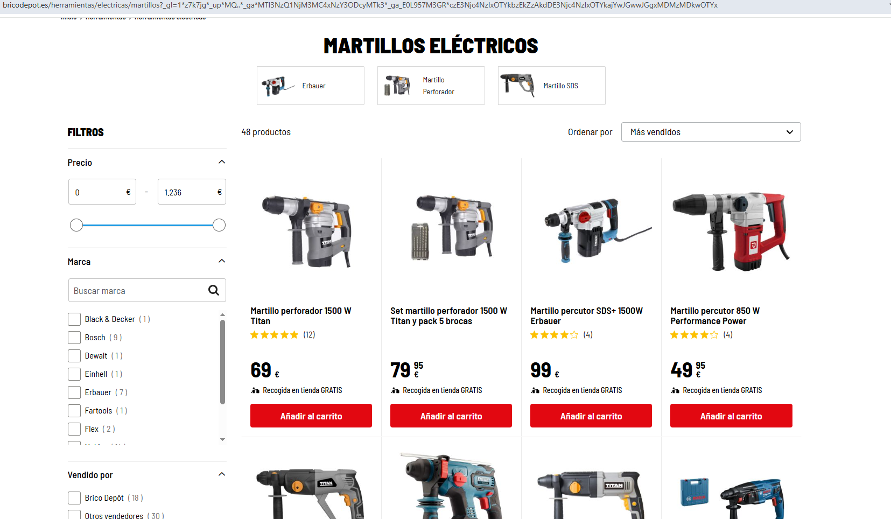
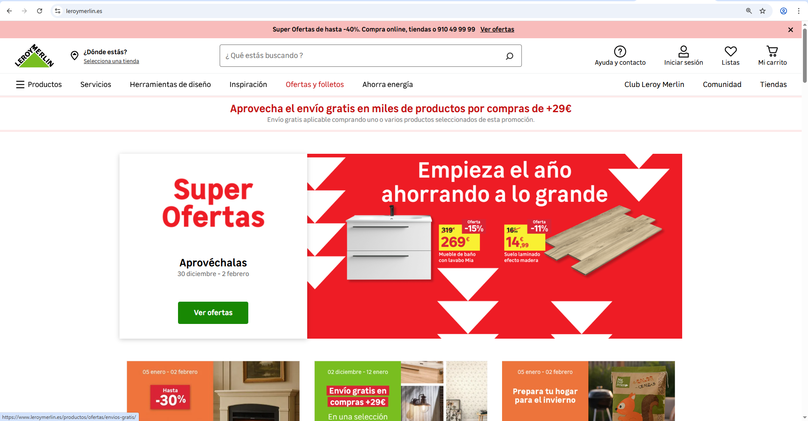
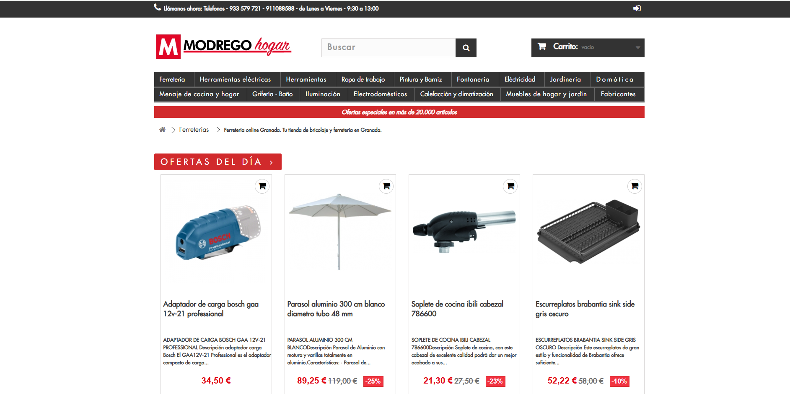
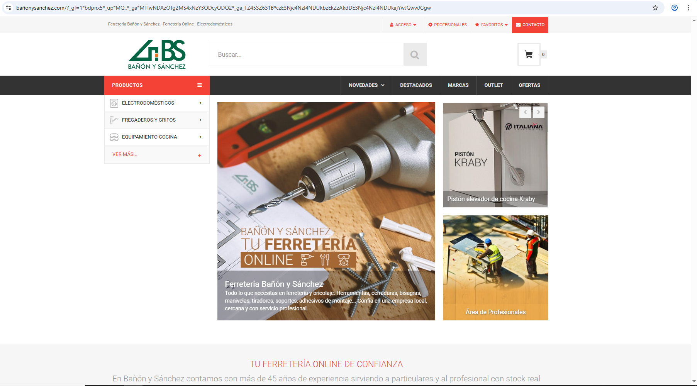

# Documentacion-app-e-shop
- Muchas ventanas
- BB.DD
- Diseño -> Marketing
- Patrones oscuros
- Pasarela fake  ----> Mis pedidos
## Base de datos(BB.DD)
tables:
  - Usuario
  - Productos
  - Pedidos

